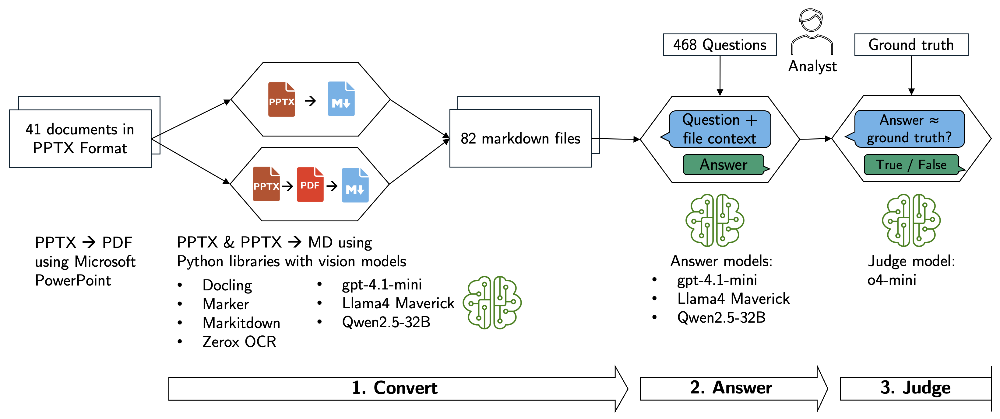

# Meet Your New Client: Writing Reports for AI

This repository holds the code for the paper: Meet Your New Client: Writing Reports for AI - Benchmarking Information Loss in Market Research Deliverables.

The paper is available on arXiv.

It sets up a benchmark to evaluate how well different file types and document conversion libraries are suitable to provide a model with context to answer factual questions about market research reports. It's implemented as a pipeline with three steps:

1. **Report Conversion**: Convert PDF and PowerPoint files to markdown format using one of four libraries: `markitdown`, `docling`, `marker`, or `zerox`. This step is executed in parallel on [Modal](https://modal.com) to leverage cloud GPUs.
2. **Question Answering**: For each question, find relevant reports and use LLMs to generate answers based on the report content.
3. **Evaluation**: Assess the accuracy of answers using an LLM as a judge by comparing against ground truth.



The following steps detail how our experiment can be run. It requires accounts with: AWS, Modal, Fireworks.ai and OpenAI.

## Reports

You can find the links to the documents in `documents.csv`. Download them from their original sources. Some documents are available on request only. Use PowerPoint to convert the PPTX files to PDF.

Place the `.pptx` and `.pdf` files in a `data/reports` directory. In addition, they must be uploaded to an AWS S3 bucket to be used by Modal.

## Configuration

This project uses [Hydra](https://hydra.cc) for configuration. [LiteLLM](https://github.com/BerriAI/litellm) is used to route LLM requests and manage a cache. The main configuration is in `config/config.yaml`, and the configuration for the LiteLLM proxy is in `config/litellm_config.yaml`.

### Report Selection

In `config/config.yaml`, you can control which files are processed. All of these settings are optional.

- `convert.suffix`: Process only files with a specific extension (e.g., `.pdf`).
- `convert.sample_first_n`: The number of files to process.
- `convert.target_files`: A list of specific filenames to process.

### Pipeline Steps

The experiment runs in three steps: `convert`, `answer`, and `judge`. You can enable or disable each step in `config/config.yaml` under the `steps` section.

### LiteLLM Proxy and Caching

This project is compatible with a wide range of LLMs and providers via LiteLLM. For the `convert` step (1), LiteLLM runs as a local proxy in each Modal container. For the `answer` and `judge` steps, the LiteLLM Python SDK is used.

Models to run on Modal are configured in the `config/litellm_config.yaml` file. Every model that you want to use needs to be added to the `model_list` section. See the [Litellm documentation on proxy servers](https://docs.litellm.ai/docs/proxy/docker_quick_start) for more information and the required environment variables (API keys, etc.).

The project uses an AWS S3 cache for LiteLLM. See the [Litellm documentation on caching](https://docs.litellm.ai/docs/proxy/caching) for more information. To enable it, set `cache: true` in `config/litellm_config.yaml` and provide the required environment variables. To check if the cache is working, run `curl --location 'http://0.0.0.0:4000/cache/ping'  -H "Authorization: Bearer sk-1234"`

### Inference providers

Currently, the project uses the OpenAI API and the Fireworks AI API. More inference providers can be added as detailed above. Currently required environment variables in your `.env` file:

```bash
# For OpenAI
OPENAI_API_KEY=sk-1234

# For Fireworks AI
FIREWORKS_AI_API_KEY=fw-1234

# For Modal cloud execution and LiteLLM S3 caching
AWS_ACCESS_KEY_ID=...
AWS_SECRET_ACCESS_KEY=...
AWS_REGION=...

LITELLM_CACHE_BUCKET=...
LITELLM_CACHE_AWS_REGION=...
```

You can optionally set `LITELLM_MAX_S3_CONNECTIONS` to allow more than the default of 10 connections for cache lookups in AWS S3.

### Modal

Create an account on Modal, which offers $30 in free credits each month. That is enough for testing some runs, but not for the full sweep. Set up secrets in Modal for all required APIs. See the [Modal documentation](https://modal.com/docs/guide) for details. You will need to create secrets for `openai-secret` `fireworks-secrets` and `aws-s3-access`. Set the same variables as in your local `.env`, as shown above.

## Run the experiment

Install the local dependencies with:

```bash
uv sync
```

Launch a run with:

```bash
uv run main.py
```

This will create a new folder in the `outputs/` folder with a log file, intermediate files and the final results. The first time this runs will take longer because Modal has to build the container image.

You can override the configuration on the command line. For example, to use the "markitdown" library instead of "docling", run:

```bash
uv run main.py convert.lib=markitdown
```

To run a sweep of multiple settings:

```bash
uv run main.py --multirun
```

This will run the experiment for each combination of settings. The combinations are specified in the `sweeper` section of the `config/config.yaml` file, which allows for defining specific configurations for each run. The outputs will be placed in a folder called `multirun`, with a sub-folder for each run.

## Paper

The paper is created with [Quarto](https://quarto.org) and the [hikmah academic template](https://github.com/andrewheiss/hikmah-academic-quarto). Ensure that LaTeX is installed. Quarto has a command to install [TinyTeX](https://quarto.org/docs/output-formats/pdf-engine.html). To render the paper, update the paths in the first code block of the paper and then run `quarto render paper/paper.qmd`.
